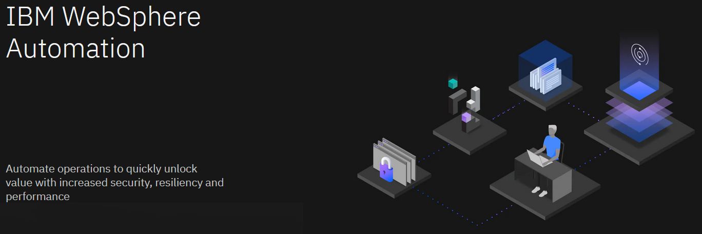
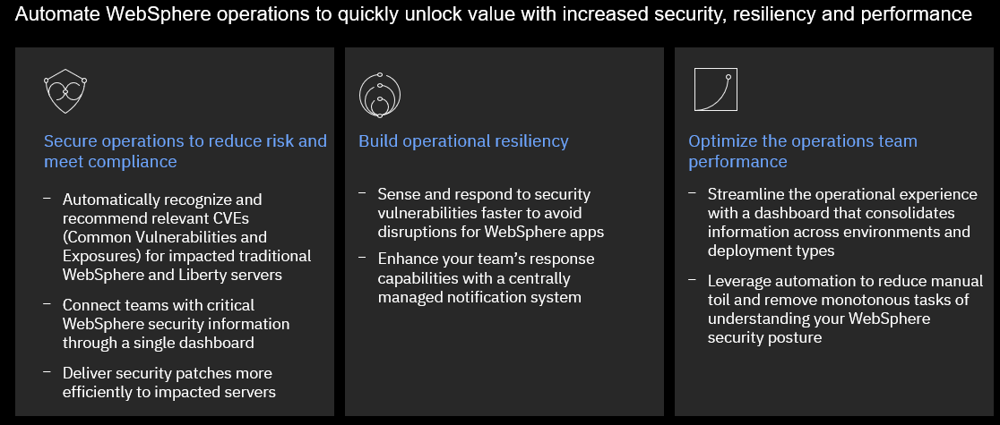

Organizations are challenged to transform quickly and maximize ROI, while keeping traditional and modern
applications running together securely. Reclaiming productivity is key to giving teams back the time required to 
innovate and build resiliency.

Unfortunately, massive transformation programs are hard to greenlight and most fail to deliver immediate results. 
According to Gartner, AI augmentation will recover 6.2 billion hours of worker productivity in 2021 – time that 
can be invested in creating a solid and secure base for WebSphere transformation.

By leveraging AI and automation, organizations can achieve immediate savings and business benefits, while 
laying a solid and secure technology foundation for future growth.

With AI and automation, teams can modernize and secure their IT estate as well as adapt and respond to 
incidents efficiently. WebSphere system administrators can reduce the cost, effort, and risk of addressing vulnerabilities and anomalies, automate critical activities, preserve uptime and remediate capacity incidents.

IBM WebSphere Automation makes business efficiency and resiliency standard. It helps teams work less on 
maintenance tasks and gives time back to focus more on strategic activities, to extend the life, increase 
the ROI, and unlock new value from WebSphere investments.

IBM WebSphere Automation is a complete solution to help administrators and operators quickly unlock value 
with increased security, resiliency and performance.

  - **Secure operations to reduce risk and meet compliance** – Automatically recognize and recommend relevant CVEs 
for specific server deployments. – Deliver security patches more efficiently to targeted environments. – Maintain 
the notification system for all the security response team members from a central location.

  - **Build operational resiliency** – Sense and respond to security vulnerabilities faster to avoid disruptions for 
WebSphere apps.

  - **Optimize runtimes and applications for operational performance** – Access consolidated information for a 
streamlined operational experience. – Reduce tedious tasks and achieve cost and time savings through optimal resource utilization, capacity provisioning and implementation of best practices across environments.

Start small, scale and standardize on IBM Automation – Build automation capabilities on top of the IBM 
Automation foundation for enterprise-level hybrid application management, observability, governance and compliance.

**IBM WebSphere Automation** is available as a stand-alone offering or as an addition to **IBM Cloud Pak® for 
Watson AIOps.**

As part of IBM Automation platform, IBM WebSphere Automation includes containerized components and common 
software services on top of a common automation layer, to manage WebSphere’s incidents, hybrid applications, 
and cost with complete observability, governance and compliance. 

Deploy virtually anywhere through containers supported by **Red Hat OpenShift** software, on **IBM Cloud**, 
on essentially any existing infrastructure 
on-premises, or through private and public clouds. Use only the capabilities you need with a fully 
modular approach that’s designed to be easy to consume.

